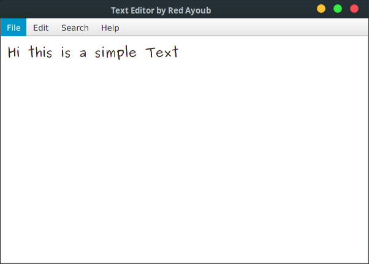
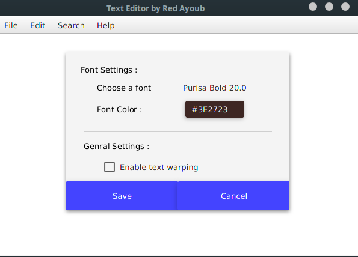
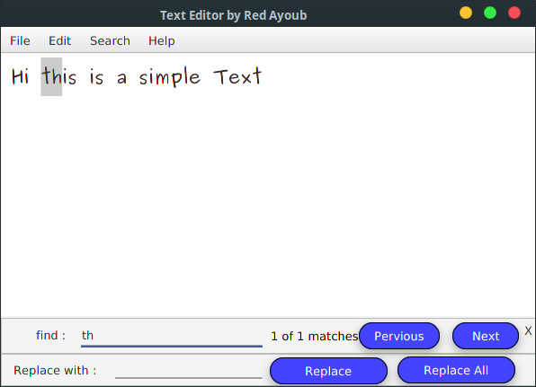
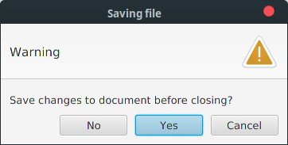
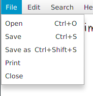
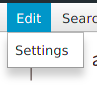
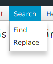

# Text Editor
A JavaFX app that alow users to read and create and edit text files

## What I Learned
- Handling Keyboard shortcuts
- Highlithing text when searching
- Handling  files in java
- Create Settings files and saving them

## Screenshots 

## To run
1. Download the release file  
2. Make sure you have oracle jre v 8 or higher
3. type in command line or terminal ` java -jar <filename>.jar `
